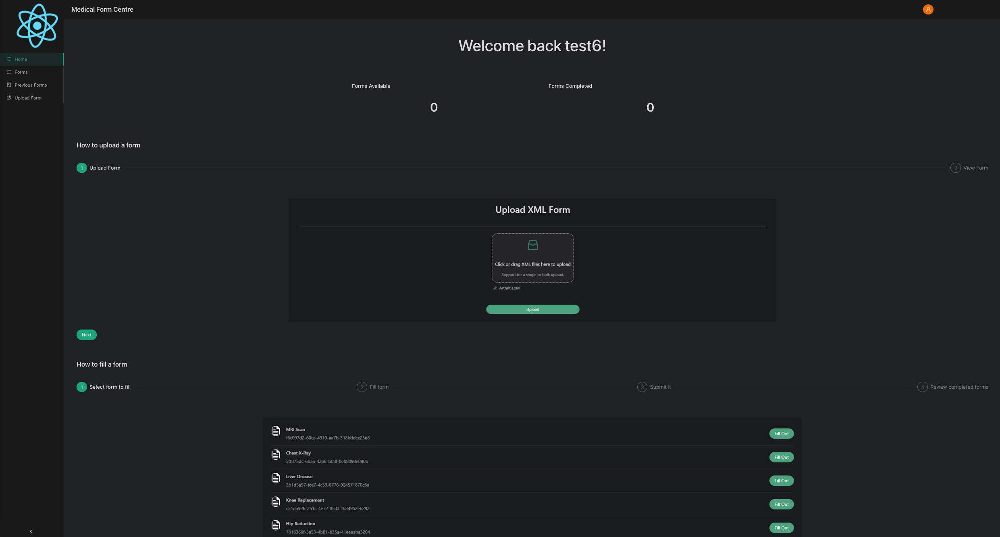

# DocForm

> A web application for doctors to keep track of the various medical forms used to create reports for different procedures.

#### This project was built using React, NodeJS, Python, PostgreSQL, AntDesign, and I deployed it to AWS.

## To start running DocForm

1. Navigate into the `backend` folder and follow the README to get the backend running.
2. Navigate into the `frontend` folder and follow the README to get the frontend running.
3. Enjoy DocForm!
